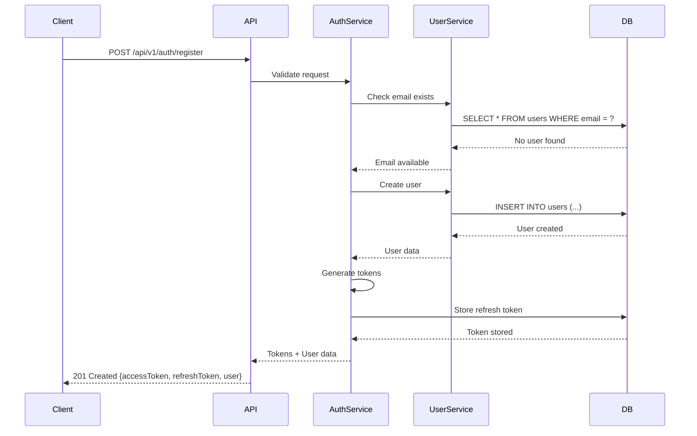
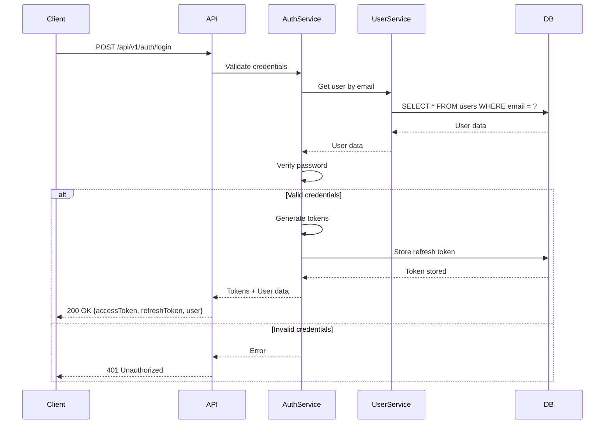
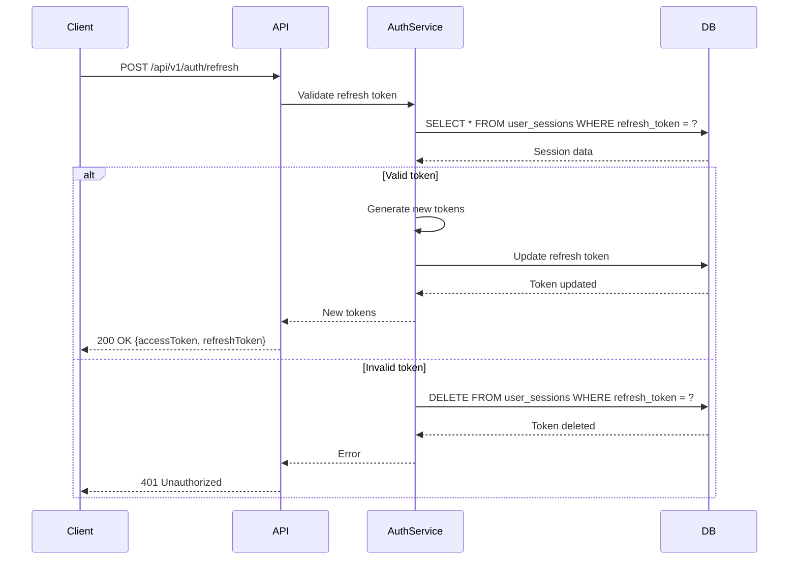
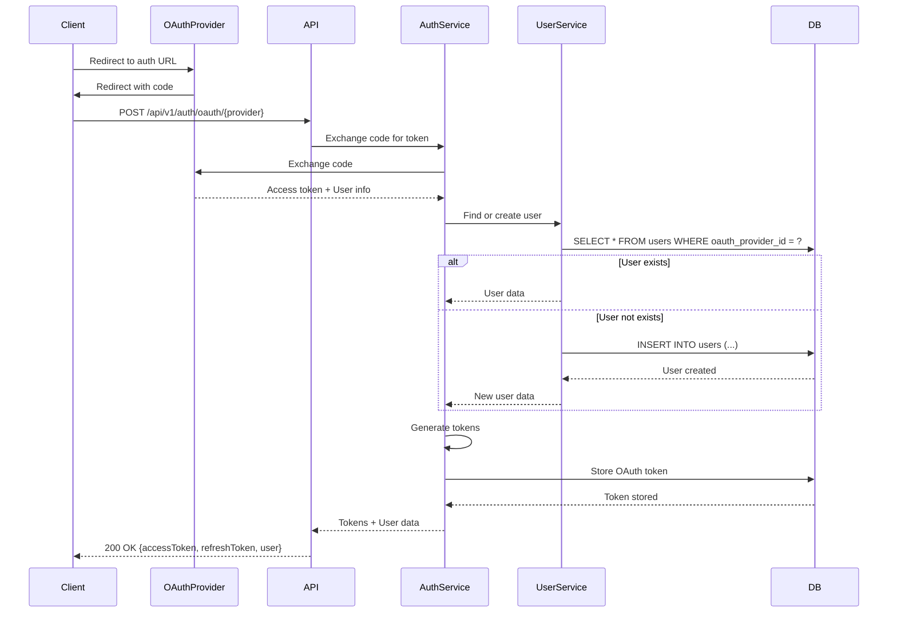

# ADR-005: Система Аутентификации для Floktask

## 📅 Методология
- **Статус:** Accepted
- **Дата:** 2026-09-12
- **Автор:** Architect
- **Участники:** Product Manager, Backend, Security Specialist

## 🎯 Контекст и проблема

### Контекст
Floktask требует надежной системы аутентификации для:
- Регистрации и входа пользователей
- Защиты API endpoints
- Поддержки нескольких устройств
- Интеграции с OAuth провайдерами
- Безопасного хранения данных

### Проблема
- ❌ Нет системы аутентификации
- ❌ Нет механизма авторизации
- ❌ Нет поддержки multi-device
- ❌ Нет интеграции с OAuth

### Драйверы (что нас мотивирует)
- **Безопасность** — Защита данных пользователей
- **Удобство** — Простой вход и регистрация
- **Масштабируемость** — Поддержка миллионов пользователей
- **Интеграции** — Поддержка OAuth 2.0
- **Совместимость** — Работа на всех платформах

## ⚖️ Варианты решения

### Вариант 1: JWT (JSON Web Tokens)
Использование JWT для аутентификации.

**Плюсы:**
- ✅ Stateless (не требует хранения сессий на сервере)
- ✅ Масштабируемость
- ✅ Поддержка всех платформ
- ✅ Простота реализации

**Минусы:**
- ❌ Сложность отзыва токенов
- ❌ Проблемы с безопасностью при неправильной реализации
- ❌ Токены могут быть большими

**Оценка:**
- **Сложность реализации:** Medium
- **Стоимость:** $
- **Время:** 1 неделя
- **Риск:** Medium

### Вариант 2: Session-Based
Классическая сессионная аутентификация.

**Плюсы:**
- ✅ Простота отзыва сессий
- ✅ Хорошо понятная модель
- ✅ Контроль над активными сессиями

**Минусы:**
- ❌ Statefull (требует хранения сессий)
- ❌ Сложность масштабирования
- ❌ Проблемы с load balancing

**Оценка:**
- **Сложность реализации:** Medium
- **Стоимость:** $
- **Время:** 1 неделя
- **Риск:** Medium

### Вариант 3: OAuth 2.0 + OpenID Connect
Использование стандартных протоколов.

**Плюсы:**
- ✅ Стандартный подход
- ✅ Поддержка сторонних провайдеров
- ✅ Хорошая безопасность
- ✅ Single Sign-On (SSO)

**Минусы:**
- ❌ Сложность реализации
- ❌ Зависимость от сторонних сервисов
- ❌ Сложность отладки

**Оценка:**
- **Сложность реализации:** High
- **Стоимость:** $$$
- **Время:** 3 недели
- **Риск:** Medium

### Вариант 4: Hybrid (JWT + OAuth 2.0)
Комбинация JWT и OAuth 2.0.

**Плюсы:**
- ✅ Лучшее из двух миров
- ✅ Stateless для API
- ✅ Поддержка OAuth провайдеров
- ✅ Масштабируемость

**Минусы:**
- ❌ Сложность реализации
- ❌ Необходимость поддерживать два механизма

**Оценка:**
- **Сложность реализации:** High
- **Стоимость:** $$$
- **Время:** 2 недели
- **Риск:** Medium

## 🎯 Выбранное решение
**Hybrid: JWT + OAuth 2.0**

### Архитектура

```
┌─────────────────────────────────────────────────────────────┐
│                      Client Applications                       │
│  ┌─────────────┐    ┌─────────────┐    ┌─────────────────┐  │
│  │   Android   │    │     iOS     │    │     Web         │  │
│  └──────┬──────┘    └──────┬──────┘    └───────┬─────────┘  │
└─────────┼─────────────────┼─────────────────┼───────────────┘
          │                 │                 │
          ▼                 ▼                 ▼
┌─────────────────────────────────────────────────────────────┐
│                      API Gateway                             │
│  ┌─────────────────────────────────────────────────────────┐│
│  │                    JWT Validation                          ││
│  │  ┌─────────────┐    ┌─────────────┐    ┌─────────────┐  ││
│  │  │  Verify     │    │  Extract    │    │  Validate   │  ││
│  │  │  Signature  │    │  Claims     │    │  Expiration │  ││
│  │  └─────────────┘    └─────────────┘    └─────────────┘  ││
│  └─────────────────────────────────────────────────────────┘│
└─────────────────────────────────────────────────────────────┘
                              │
                              ▼
┌─────────────────────────────────────────────────────────────┐
│                      Auth Service                             │
│  ┌─────────────────────────────────────────────────────────┐│
│  │                    Authentication                         ││
│  │  ┌─────────────┐    ┌─────────────┐    ┌─────────────┐  ││
│  │  │  Register   │    │   Login     │    │  Refresh    │  ││
│  │  │             │    │             │    │  Token      │  ││
│  │  └─────────────┘    └─────────────┘    └─────────────┘  ││
│  └─────────────────────────────────────────────────────────┘│
│  ┌─────────────────────────────────────────────────────────┐│
│  │                    OAuth 2.0                              ││
│  │  ┌─────────────┐    ┌─────────────┐    ┌─────────────┐  ││
│  │  │  Google     │    │  Yandex     │    │  GitHub     │  ││
│  │  │  OAuth      │    │  OAuth      │    │  OAuth      │  ││
│  │  └─────────────┘    └─────────────┘    └─────────────┘  ││
│  └─────────────────────────────────────────────────────────┘│
└─────────────────────────────────────────────────────────────┘
                              │
                              ▼
┌─────────────────────────────────────────────────────────────┐
│                      Database Layer                           │
│  ┌─────────────────────────────────────────────────────────┐│
│  │                    PostgreSQL                             ││
│  │  ┌─────────────┐    ┌─────────────┐    ┌─────────────┐  ││
│  │  │   Users     │    │   Sessions   │    │  OAuth      │  ││
│  │  │             │    │             │    │  Tokens     │  ││
│  │  └─────────────┘    └─────────────┘    └─────────────┘  ││
│  └─────────────────────────────────────────────────────────┘│
│  ┌─────────────────────────────────────────────────────────┐│
│  │                    Redis                                   ││
│  │  ┌─────────────┐    ┌─────────────┐    ┌─────────────┐  ││
│  │  │  Blacklist  │    │  Rate       │    │  Session    │  ││
│  │  │  (Tokens)   │    │  Limiting    │    │  Cache      │  ││
│  │  └─────────────┘    └─────────────┘    └─────────────┘  ││
│  └─────────────────────────────────────────────────────────┘│
└─────────────────────────────────────────────────────────────┘
```

### JWT Structure

#### Access Token
```json
{
  "header": {
    "alg": "HS256",
    "typ": "JWT",
    "kid": "key-1"
  },
  "payload": {
    "sub": "user-uuid",
    "userId": 123,
    "email": "user@example.com",
    "roles": ["USER"],
    "permissions": ["read:tasks", "write:tasks", "read:projects"],
    "iat": 1725000000,
    "exp": 1725003600,
    "iss": "floktask.com",
    "aud": "floktask-api",
    "jti": "unique-token-id",
    "deviceId": "device-uuid",
    "sessionId": "session-uuid"
  },
  "signature": "..."
}
```

#### Refresh Token
```json
{
  "header": {
    "alg": "HS256",
    "typ": "JWT"
  },
  "payload": {
    "sub": "user-uuid",
    "userId": 123,
    "iat": 1725000000,
    "exp": 1725604800,  // 7 дней
    "iss": "floktask.com",
    "jti": "unique-refresh-token-id",
    "deviceId": "device-uuid"
  },
  "signature": "..."
}
```

### Authentication Flow

#### Registration Flow



#### Login Flow



#### Token Refresh Flow



#### OAuth 2.0 Flow



### Security Measures

#### Password Security
- **Hashing**: bcrypt с salt
- **Complexity**: Минимальная длина 8 символов
- **Strength**: Проверка сложности пароля

#### Token Security
- **Algorithm**: HS256 (symmetrical) или RS256 (asymmetrical)
- **Secret**: Длинный случайный ключ (256+ бит)
- **Expiration**: Access token — 1 час, Refresh token — 7 дней
- **Storage**: Refresh tokens хранятся в БД

#### Rate Limiting
- **Login attempts**: 5 попыток в минуту
- **Registration**: 3 регистрации в час с одного IP
- **API requests**: 100 запросов в минуту

#### Brute Force Protection
- **Account lockout**: После 10 неудачных попыток — блокировка на 15 минут
- **CAPTCHA**: После 3 неудачных попыток
- **IP blocking**: Временная блокировка IP при подозрительной активности

#### Session Management
- **Multiple devices**: Поддержка нескольких устройств
- **Session listing**: Просмотр активных сессий
- **Remote logout**: Возможность завершить сессию удаленно
- **Device info**: Хранение информации об устройствах

### API Security

#### Authentication Middleware
```kotlin
class JwtAuthenticationFilter : OncePerRequestFilter() {
    override fun doFilterInternal(
        request: HttpServletRequest,
        response: HttpServletResponse,
        filterChain: FilterChain
    ) {
        val token = extractToken(request)
        
        if (token != null && jwtService.validateToken(token)) {
            val claims = jwtService.extractClaims(token)
            val userId = claims["userId"] as Long
            val roles = claims["roles"] as List<String>
            
            val authentication = UsernamePasswordAuthenticationToken(
                userId, null, roles.map { SimpleGrantedAuthority(it) }
            )
            
            SecurityContextHolder.getContext().authentication = authentication
        }
        
        filterChain.doFilter(request, response)
    }
}
```

#### Authorization
```kotlin
@Configuration
@EnableMethodSecurity
class SecurityConfig {
    @Bean
    fun securityFilterChain(http: HttpSecurity): SecurityFilterChain {
        return http
            .csrf { it.disable() }
            .authorizeHttpRequests { auth ->
                auth
                    .requestMatchers("/api/v1/auth/**").permitAll()
                    .requestMatchers("/api/v1/public/**").permitAll()
                    .requestMatchers(HttpMethod.GET, "/api/v1/tasks/**").hasAuthority("read:tasks")
                    .requestMatchers(HttpMethod.POST, "/api/v1/tasks/**").hasAuthority("write:tasks")
                    .anyRequest().authenticated()
            }
            .sessionManagement { it.sessionCreationPolicy(SessionCreationPolicy.STATELESS) }
            .addFilterBefore(jwtAuthenticationFilter, UsernamePasswordAuthenticationFilter::class.java)
            .build()
    }
}
```

#### Role-Based Access Control (RBAC)

| Роль | Описание | Разрешения |
|------|----------|-------------|
| `USER` | Обычный пользователь | Чтение/запись своих данных |
| `PREMIUM` | Премиум пользователь | + Расширенные функции |
| `ADMIN` | Администратор | Полный доступ к API |
| `SUPER_ADMIN` | Супер-админ | Полный доступ ко всем данным |

#### Permission Matrix

| Ресурс | USER | PREMIUM | ADMIN | SUPER_ADMIN |
|--------|------|---------|-------|-------------|
| Tasks | R/W | R/W | R/W/D | R/W/D |
| Projects | R/W | R/W | R/W/D | R/W/D |
| Users | R | R | R/W/D | R/W/D |
| Settings | R/W | R/W | R/W | R/W |
| AI Features | Limited | Full | Full | Full |
| Admin Panel | - | - | R/W | R/W |

### OAuth 2.0 Providers

| Провайдер | Поддержка | Scope |
|-----------|----------|-------|
| Google | ✅ | email, profile |
| Yandex | ✅ | login:email, login:info |
| GitHub | ✅ | user:email, user:profile |
| Apple | ✅ | name, email |
| Telegram | ✅ | basic |

### Multi-Factor Authentication (MFA)

#### TOTP (Time-based One-Time Password)
- **Algorithm**: SHA-1
- **Period**: 30 секунд
- **Digits**: 6 цифр
- **Backup codes**: 10 одноразовых кодов

#### Implementation
```kotlin
class TotpService {
    fun generateSecret(userId: Long): String {
        val secret = ByteArray(20)
        SecureRandom().nextBytes(secret)
        return Base32.encode(secret)
    }
    
    fun generateTotp(secret: String): String {
        val key = Base32.decode(secret)
        val timeIndex = (System.currentTimeMillis() / 1000 / 30).toLong()
        val data = ByteArray(8)
        for (i in 7 downTo 0) {
            data[i] = (timeIndex and 0xff.toLong()).toByte()
            timeIndex shr= 8
        }
        val hash = Mac.getInstance("HmacSHA1").apply {
            init(SecretKeySpec(key, ""))
        }.doFinal(data)
        
        val offset = hash[hash.size - 1].toInt() and 0xf
        val binary = ((hash[offset].toInt() and 0x7f) shl 24) or
            ((hash[offset + 1].toInt() and 0xff) shl 16) or
            ((hash[offset + 2].toInt() and 0xff) shl 8) or
            (hash[offset + 3].toInt() and 0xff)
        
        return (binary % 1_000_000).toString().padStart(6, '0')
    }
    
    fun verifyTotp(secret: String, code: String): Boolean {
        val currentTotp = generateTotp(secret)
        val previousTotp = generateTotpForTime((System.currentTimeMillis() / 1000 / 30) - 1, secret)
        return code == currentTotp || code == previousTotp
    }
}
```

## 📊 Последствия

### Положительные
- ✅ Высокая безопасность
- ✅ Поддержка всех платформ
- ✅ Масштабируемость
- ✅ Удобство для пользователей
- ✅ Интеграция с OAuth провайдерами

### Отрицательные
- ⚠️ Сложность реализации
- ⚠️ Необходимость поддержки нескольких механизмов
- ⚠️ Затраты на безопасность

### Нейтральные
- 🔹 Необходимость мониторинга безопасности
- 🔹 Регулярный аудит безопасности

## 🔗 Связанные решения
- [ADR-001: Микросервисная архитектура](ADR-001-microservices.md) — Auth Service
- [ADR-003: API дизайн](ADR-003-api-design.md) — Authentication endpoints
- [ADR-004: Схема базы данных](ADR-004-database-schema.md) — Users and sessions tables

## 📝 Примечания
- **JWT Best Practices**: Следуем RFC 7519
- **OAuth 2.0**: Следуем RFC 6749 и RFC 6750
- **Password Storage**: Используем bcrypt с cost factor 12
- **Token Rotation**: Обновляем refresh tokens при использовании
- **Security Headers**: CSP, XSS protection, HSTS
- **HTTPS Only**: Все запросы только по HTTPS
- **CORS**: Настройка CORS для веб-клиентов

## ✅ Статус
- [ ] Proposed
- [ ] Under Discussion
- [x] Accepted
- [ ] Deprecated
- [ ] Replaced by [ADR-ZZZ]
