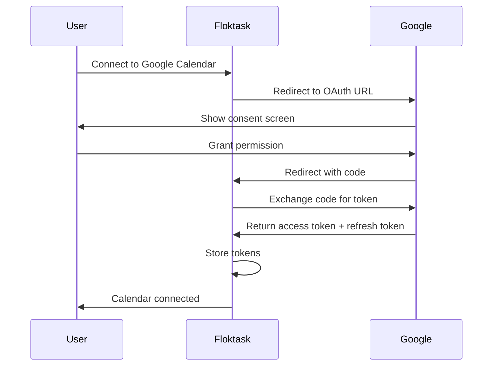

# ADR-011: Интеграции с Внешними Сервисами

## 📅 Методология
- **Статус:** Accepted
- **Дата:** 2026-09-28
- **Автор:** Architect
- **Участники:** Product Manager, Backend, Frontend

## 🎯 Контекст и проблема

### Контекст
Floktask должен интегрироваться с внешними сервисами для:
- **Синхронизации с календарями** (Google Calendar, Apple Calendar, Outlook)
- **Уведомлений через мессенджеры** (Telegram, Slack, Discord)
- **Отправки email уведомлений**
- **Импорта/экспорта данных**
- **AI интеграций** (уже покрыто в ADR-001)

Это критично для:
- Автоматизации рабочих процессов
- Удобства пользователей
- Синхронизации с существующими инструментами
- Расширения функциональности

### Проблема
- ❌ Нет интеграции с календарями
- ❌ Нет уведомлений через Telegram/Slack
- ❌ Ограниченные email уведомления
- ❌ Нет импорта/экспорта данных

### Драйверы (что нас мотивирует)
- **Пользовательский опыт** — Интеграция с привычными инструментами
- **Автоматизация** — Уменьшение ручной работы
- **Синхронизация** — Единое пространство задач
- **Конкурентоспособность** — Todoist и TickTick имеют такие интеграции
- **Удержание пользователей** — Больше интеграций = больше удержание

## ⚖️ Варианты решения

### Вариант 1: Прямые API интеграции
Прямое использование API внешних сервисов.

**Плюсы:**
- ✅ Полный контроль
- ✅ Нет посредников
- ✅ Гибкость

**Минусы:**
- ❌ Сложность поддержки многих интеграций
- ❌ Необходимость обновлять при изменениях API
- ❌ Сложность аутентификации

**Оценка:**
- **Сложность реализации:** High
- **Стоимость:** $$$
- **Время:** 6-8 недель
- **Риск:** Medium

### Вариант 2: Использование Zapier/Integromat
Поддержка через платформы автоматизации.

**Плюсы:**
- ✅ Быстрая реализация
- ✅ Множество интеграций "из коробки"
- ✅ Нет необходимости поддерживать

**Минусы:**
- ❌ Зависимость от стороннего сервиса
- ❌ Ограниченная функциональность
- ❌ Платная подписка для пользователей

**Оценка:**
- **Сложность реализации:** Low
- **Стоимость:** $
- **Время:** 1-2 недели
- **Риск:** Low

### Вариант 3: Webhooks
Использование webhooks для интеграций.

**Плюсы:**
- ✅ Простота реализации
- ✅ Реальное время
- ✅ Гибкость

**Минусы:**
- ❌ Ограниченная функциональность
- ❌ Сложность отладки
- ❌ Не все сервисы поддерживают webhooks

**Оценка:**
- **Сложность реализации:** Medium
- **Стоимость:** $$
- **Время:** 2-3 недели
- **Риск:** Medium

### Вариант 4: Hybrid (Прямые API + Webhooks + Zapier)
Комбинация разных подходов.

**Плюсы:**
- ✅ Лучшее из всех миров
- ✅ Гибкость
- ✅ Поддержка всех сценариев

**Минусы:**
- ❌ Сложность реализации
- ❌ Необходимость поддерживать несколько подходов

**Оценка:**
- **Сложность реализации:** High
- **Стоимость:** $$$
- **Время:** 4-6 недель
- **Риск:** Medium

## 🎯 Выбранное решение
**Hybrid Approach** — Прямые API интеграции + Webhooks + Zapier поддержка.

### Архитектура

```
┌─────────────────────────────────────────────────────────────────────────────┐
│                    Integration Architecture                                  │
├─────────────────────────────────────────────────────────────────────────────┤
│                                                                              │
│  ┌─────────────────────────────────────────────────────────────────────┐   │
│  │                        Floktask Backend                                  │   │
│  │  ┌───────────────────────────────────────────────────────────────┐ │   │
│  │  │                    Integration Service                             │ │   │
│  │  │  ┌─────────────┐    ┌─────────────┐    ┌─────────────────────┐  │ │   │
│  │  │  │  Calendar    │    │  Messenger   │    │  Email             │  │ │   │
│  │  │  │  Service     │    │  Service     │    │  Service           │  │ │   │
│  │  │  └─────────────┘    └─────────────┘    └─────────────────────┘  │ │   │
│  │  │                                                                   │ │   │
│  │  │  ┌───────────────────────────────────────────────────────────┐ │ │   │
│  │  │  │                    Webhook Handler                            │ │ │   │
│  │  │  │  - Incoming Webhooks                                            │ │ │   │
│  │  │  │  - Outgoing Webhooks                                            │ │ │   │
│  │  │  └───────────────────────────────────────────────────────────┘ │ │   │
│  │  └───────────────────────────────────────────────────────────────┘ │   │
│  └─────────────────────────────────────────────────────────────────────┘   │
│                                    │                                         │
│                                    ▼                                         │
│  ┌─────────────────────────────────────────────────────────────────────┐   │
│  │                    External Services                                   │   │
│  │  ┌─────────────┐    ┌─────────────┐    ┌─────────────────────────┐  │   │
│  │  │  Google     │    │  Apple      │    │  Microsoft              │  │   │
│  │  │  Calendar   │    │  Calendar   │    │  Outlook Calendar        │  │   │
│  │  └─────────────┘    └─────────────┘    └─────────────────────────┘  │   │
│  │                                                                       │   │
│  │  ┌─────────────┐    ┌─────────────┐    ┌─────────────────────────┐  │   │
│  │  │  Telegram   │    │  Slack      │    │  Discord                │  │   │
│  │  │  Bot API    │    │  Webhooks   │    │  Webhooks               │  │   │
│  │  └─────────────┘    └─────────────┘    └─────────────────────────┘  │   │
│  │                                                                       │   │
│  │  ┌─────────────┐    ┌─────────────┐    ┌─────────────────────────┐  │   │
│  │  │  SMTP       │    │  SendGrid   │    │  Mailgun               │  │   │
│  │  │  Server     │    │  API        │    │  API                   │  │   │
│  │  └─────────────┘    └─────────────┘    └─────────────────────────┘  │   │
│  └─────────────────────────────────────────────────────────────────────┘   │
│                                    │                                         │
│                                    ▼                                         │
│  ┌─────────────────────────────────────────────────────────────────────┐   │
│  │                    Zapier / Integromat                                  │   │
│  │  (Optional integration for power users)                               │   │
│  └─────────────────────────────────────────────────────────────────────┘   │
│                                                                              │
└─────────────────────────────────────────────────────────────────────────────┘
```

### Компоненты

#### 1. Integration Service

**Ответственность:**
- Управление интеграциями
- Аутентификация с внешними сервисами
- Синхронизация данных
- Отправка уведомлений

**Структура:**
```
integration-service/
├── src/
│   ├── main/
│   │   ├── kotlin/com/floktask/integration/
│   │   │   ├── config/           # Конфигурация интеграций
│   │   │   ├── service/          # Сервисы интеграций
│   │   │   │   ├── calendar/     # Календари
│   │   │   │   ├── messenger/    # Мессенджеры
│   │   │   │   ├── email/        # Email
│   │   │   │   └── webhook/      # Webhooks
│   │   │   ├── model/            # Модели данных
│   │   │   ├── repository/       # Репозитории
│   │   │   ├── scheduler/        # Планировщик
│   │   │   └── controller/       # API контроллеры
│   │   └── resources/
│   │       ├── application.yaml
│   │       └── integration-config.yaml
└── build.gradle.kts
```

#### 2. Calendar Service

**Поддерживаемые календари:**
- Google Calendar
- Apple Calendar (iCloud)
- Microsoft Outlook Calendar
- CalDAV (универсальный)

**Функционал:**
- Синхронизация задач с календарем
- Создание событий из задач
- Обновление событий при изменении задач
- Удаление событий при удалении задач
- Чтение событий из календаря

**API Endpoints:**
```
POST   /api/v1/integrations/calendar/connect    # Подключение календаря
DELETE /api/v1/integrations/calendar/{id}      # Отключение календаря
GET    /api/v1/integrations/calendar            # Список подключенных календарей
GET    /api/v1/integrations/calendar/{id}/sync   # Синхронизация календаря
POST   /api/v1/integrations/calendar/{id}/sync   # Принудительная синхронизация
GET    /api/v1/integrations/calendar/events     # Получение событий из календаря
POST   /api/v1/integrations/calendar/events      # Создание события в календаре
```

**OAuth Flow:**


**Синхронизация:**
```kotlin
class CalendarSyncService(
    private val calendarRepository: CalendarRepository,
    private val taskRepository: TaskRepository,
    private val googleCalendarClient: GoogleCalendarClient,
    private val appleCalendarClient: AppleCalendarClient
) {
    
    @Scheduled(cron = "0 * * * * *") // Каждую минуту
    fun syncAllCalendars() {
        val calendars = calendarRepository.findAllActive()
        calendars.forEach { calendar ->
            try {
                syncCalendar(calendar)
            } catch (e: Exception) {
                log.error("Failed to sync calendar ${calendar.id}", e)
            }
        }
    }
    
    fun syncCalendar(calendar: CalendarIntegration) {
        val client = getClient(calendar.provider)
        
        // Получаем задачи, которые нужно синхронизировать
        val tasks = taskRepository.findTasksForSync(calendar.userId, calendar.lastSyncAt)
        
        // Создаем или обновляем события в календаре
        tasks.forEach { task ->
            val event = createEventFromTask(task, calendar)
            client.upsertEvent(calendar.calendarId, event)
        }
        
        // Получаем события из календаря
        val events = client.getEvents(calendar.calendarId, calendar.lastSyncAt)
        
        // Синхронизируем задачи с событиями
        syncTasksWithEvents(tasks, events, calendar)
        
        // Обновляем время последней синхронизации
        calendarRepository.updateLastSyncAt(calendar.id, Instant.now())
    }
    
    private fun createEventFromTask(task: Task, calendar: CalendarIntegration): CalendarEvent {
        return CalendarEvent(
            id = task.uuid,
            title = task.title,
            description = task.description,
            start = task.startDate ?: Instant.now(),
            end = task.dueDate ?: task.startDate?.plus(task.durationMinutes, ChronoUnit.MINUTES),
            location = null,
            color = getColorForPriority(task.priority),
            reminder = task.reminderDate?.let { 
                CalendarReminder(minutesBefore = Duration.between(Instant.now(), it).toMinutes())
            }
        )
    }
    
    private fun getClient(provider: CalendarProvider): CalendarClient {
        return when (provider) {
            CalendarProvider.GOOGLE -> googleCalendarClient
            CalendarProvider.APPLE -> appleCalendarClient
            CalendarProvider.OUTLOOK -> outlookCalendarClient
            CalendarProvider.CALDAV -> caldavCalendarClient
        }
    }
}
```

#### 3. Messenger Service

**Поддерживаемые мессенджеры:**
- Telegram
- Slack
- Discord
- Microsoft Teams (будущее)

**Функционал:**
- Отправка уведомлений о задачах
- Отправка напоминаний
- Интерактивные кнопки (для Telegram)
- Подписка на уведомления

**API Endpoints:**
```
POST   /api/v1/integrations/messenger/connect    # Подключение мессенджера
DELETE /api/v1/integrations/messenger/{id}      # Отключение мессенджера
GET    /api/v1/integrations/messenger            # Список подключенных мессенджеров
POST   /api/v1/integrations/messenger/{id}/test   # Тестовое уведомление
POST   /api/v1/integrations/messenger/webhook     # Webhook для входящих сообщений
```

**Telegram Bot Implementation:**
```kotlin
@Component
class TelegramBotService(
    private val telegramBot: TelegramBot,
    private val notificationRepository: NotificationRepository,
    private val taskRepository: TaskRepository
) : MessengerService {
    
    override fun sendNotification(userId: Long, notification: Notification) {
        val userSettings = notificationRepository.findSettings(userId, MessengerProvider.TELEGRAM)
        
        if (userSettings?.enabled == true) {
            val chatId = userSettings.chatId
            val message = formatNotification(notification)
            
            telegramBot.sendMessage(chatId, message, notification.taskId)
        }
    }
    
    override fun sendReminder(task: Task) {
        val userSettings = notificationRepository.findSettings(task.userId, MessengerProvider.TELEGRAM)
        
        if (userSettings?.enabled == true && userSettings.remindersEnabled == true) {
            val chatId = userSettings.chatId
            val message = "🔔 Напоминание: ${task.title}\n\nСрок: ${formatDate(task.dueDate)}"
            
            telegramBot.sendMessage(chatId, message, task.id)
        }
    }
    
    private fun formatNotification(notification: Notification): String {
        return when (notification.type) {
            NotificationType.TASK_CREATED -> "✅ Новая задача: ${notification.title}"
            NotificationType.TASK_COMPLETED -> "✅ Задача выполнена: ${notification.title}"
            NotificationType.TASK_DUE -> "⚠️ Срок задачи: ${notification.title}"
            NotificationType.PROJECT_UPDATE -> "📋 Обновление проекта: ${notification.title}"
            else -> notification.message
        }
    }
    
    // Обработка callback от Telegram
    fun handleCallback(callbackQuery: CallbackQuery) {
        val data = callbackQuery.data
        val taskId = data.substringAfter(":")
        
        when (data.substringBefore(":")) {
            "complete" -> {
                val task = taskRepository.findById(taskId.toLong())
                if (task != null) {
                    taskRepository.completeTask(task.id)
                    telegramBot.editMessage(
                        callbackQuery.message.chat.id,
                        callbackQuery.message.messageId,
                        "✅ Задача выполнена: ${task.title}"
                    )
                }
            }
            "snooze" -> {
                // Отложить задачу
            }
        }
    }
}

// Telegram Bot Configuration
@Configuration
class TelegramConfig {
    
    @Value("\${telegram.bot.token}")
    private lateinit var botToken: String
    
    @Bean
    fun telegramBot(): TelegramBot {
        return TelegramBot.Builder(botToken)
            .build()
    }
    
    @Bean
    fun telegramUpdateListener(
        telegramBot: TelegramBot,
        telegramBotService: TelegramBotService
    ): TelegramUpdateListener {
        return TelegramUpdateListener { update ->
            if (update.hasCallbackQuery()) {
                telegramBotService.handleCallback(update.callbackQuery)
            }
            if (update.hasMessage()) {
                telegramBotService.handleMessage(update.message)
            }
        }
    }
}
```

#### 4. Email Service

**Поддерживаемые провайдеры:**
- SMTP (self-hosted)
- SendGrid
- Mailgun
- Amazon SES
- Postmark

**Функционал:**
- Отправка email уведомлений
- Шаблоны email
- Массовая рассылка
- Статистика отправок

**API Endpoints:**
```
POST   /api/v1/integrations/email/connect      # Подключение email провайдера
DELETE /api/v1/integrations/email/{id}        # Отключение email провайдера
GET    /api/v1/integrations/email              # Список подключенных email провайдеров
POST   /api/v1/integrations/email/test         # Тестовая отправка
GET    /api/v1/integrations/email/templates    # Шаблоны email
POST   /api/v1/integrations/email/templates    # Создание шаблона
```

**Email Template Engine:**
```kotlin
@Component
class EmailTemplateService {
    
    private val templates = mutableMapOf<String, EmailTemplate>()
    
    init {
        loadDefaultTemplates()
    }
    
    fun renderTemplate(templateName: String, context: Map<String, Any>): String {
        val template = templates[templateName] ?: throw TemplateNotFoundException(templateName)
        return template.engine.render(template.content, context)
    }
    
    private fun loadDefaultTemplates() {
        templates["task_created"] = EmailTemplate(
            name = "task_created",
            subject = "Новая задача: {{title}}",
            content = """
                <h1>Новая задача создана</h1>
                <p><strong>{{title}}</strong></p>
                <p>{{description}}</p>
                <p>Срок: {{dueDate}}</p>
                <p>Приоритет: {{priority}}</p>
                <p><a href="{{appUrl}}/tasks/{{taskId}}">Открыть задачу</a></p>
            """.trimIndent(),
            engine = HandlebarsEngine()
        )
        
        templates["task_due"] = EmailTemplate(
            name = "task_due",
            subject = "⚠️ Срок задачи: {{title}}",
            content = """
                <h1>Срок задачи истекает</h1>
                <p>Задача <strong>{{title}}</strong> должна быть выполнена до {{dueDate}}</p>
                <p><a href="{{appUrl}}/tasks/{{taskId}}">Открыть задачу</a></p>
            """.trimIndent(),
            engine = HandlebarsEngine()
        )
    }
}

@Component
class EmailService(
    private val emailProviderRepository: EmailProviderRepository,
    private val emailTemplateService: EmailTemplateService,
    private val sendGridClient: SendGridClient? = null,
    private val smtpClient: SmtpClient? = null
) {
    
    suspend fun sendEmail(userId: Long, emailType: EmailType, context: Map<String, Any>) {
        val user = userService.getUser(userId)
        val provider = emailProviderRepository.findDefault(userId)
        
        if (user.emailNotificationsEnabled && provider != null) {
            val template = emailTemplateService.renderTemplate(emailType.templateName, context)
            
            val email = Email(
                to = listOf(user.email),
                subject = renderSubject(emailType.subjectTemplate, context),
                htmlContent = template,
                textContent = htmlToText(template)
            )
            
            sendEmail(email, provider)
        }
    }
    
    private suspend fun sendEmail(email: Email, provider: EmailProvider) {
        when (provider.type) {
            EmailProviderType.SENDGRID -> sendGridClient?.send(email)
            EmailProviderType.MAILGUN -> mailgunClient?.send(email)
            EmailProviderType.SMTP -> smtpClient?.send(email)
            EmailProviderType.AMAZON_SES -> sesClient?.send(email)
        }
    }
}
```

#### 5. Webhook Service

**Функционал:**
- Прием входящих webhooks
- Отправка исходящих webhooks
- Валидация подписей
- Retry механизм

**API Endpoints:**
```
POST   /api/v1/webhooks/{provider}/{secret}    # Прием webhook
GET    /api/v1/webhooks                        # Список webhooks
POST   /api/v1/webhooks                        # Создание webhook
DELETE /api/v1/webhooks/{id}                  # Удаление webhook
POST   /api/v1/webhooks/{id}/test              # Тестовый webhook
```

**Webhook Implementation:**
```kotlin
@RestController
@RequestMapping("/api/v1/webhooks")
class WebhookController(
    private val webhookService: WebhookService,
    private val webhookValidator: WebhookValidator
) {
    
    @PostMapping("/{provider}/{secret}")
    fun handleWebhook(
        @PathVariable provider: String,
        @PathVariable secret: String,
        @RequestBody payload: String,
        @RequestHeader("X-Signature") signature: String?
    ): ResponseEntity<Void> {
        // Проверяем подпись
        if (!webhookValidator.validateSignature(provider, secret, payload, signature)) {
            return ResponseEntity.status(HttpStatus.UNAUTHORIZED).build()
        }
        
        // Обрабатываем webhook
        val result = webhookService.handleWebhook(provider, secret, payload)
        
        return if (result) {
            ResponseEntity.ok().build()
        } else {
            ResponseEntity.badRequest().build()
        }
    }
}

@Component
class WebhookService(
    private val webhookRepository: WebhookRepository,
    private val taskService: TaskService
) {
    
    fun handleWebhook(provider: String, secret: String, payload: String): Boolean {
        val webhook = webhookRepository.findByProviderAndSecret(provider, secret)
            ?: return false
        
        return try {
            when (provider) {
                "github" -> handleGitHubWebhook(webhook, payload)
                "gitlab" -> handleGitLabWebhook(webhook, payload)
                "telegram" -> handleTelegramWebhook(webhook, payload)
                "slack" -> handleSlackWebhook(webhook, payload)
                else -> false
            }
        } catch (e: Exception) {
            log.error("Failed to handle webhook for provider $provider", e)
            false
        }
    }
    
    private fun handleGitHubWebhook(webhook: Webhook, payload: String): Boolean {
        val event = parseGitHubEvent(payload)
        
        when (event.type) {
            "push" -> {
                // Создать задачу из коммита
                val task = createTaskFromCommit(event.commit)
                taskService.createTask(task)
            }
            "pull_request" -> {
                // Создать задачу из PR
                val task = createTaskFromPullRequest(event.pullRequest)
                taskService.createTask(task)
            }
            else -> return false
        }
        
        return true
    }
    
    private fun handleTelegramWebhook(webhook: Webhook, payload: String): Boolean {
        val update = parseTelegramUpdate(payload)
        
        if (update.hasMessage()) {
            // Обработка сообщения
            handleTelegramMessage(update.message)
        } else if (update.hasCallbackQuery()) {
            // Обработка callback
            handleTelegramCallback(update.callbackQuery)
        }
        
        return true
    }
}

@Component
class WebhookValidator {
    
    private val secrets = mutableMapOf<String, String>()
    
    fun validateSignature(provider: String, secret: String, payload: String, signature: String?): Boolean {
        if (signature == null) return false
        
        val expectedSignature = when (provider) {
            "github" -> "sha1=" + HmacUtils.hmacSha1Hex(secret, payload)
            "gitlab" -> "sha256=" + HmacUtils.hmacSha256Hex(secret, payload)
            "slack" -> verifySlackSignature(secret, payload, signature)
            else -> return false
        }
        
        return expectedSignature == signature
    }
    
    private fun verifySlackSignature(secret: String, payload: String, signature: String): Boolean {
        // Slack uses timestamp + signature
        val timestamp = signature.substringBefore(":")
        val signaturePart = signature.substringAfter(":")
        
        val basestring = "v0:$timestamp:$payload"
        val hash = HmacUtils.hmacSha256Hex(secret, basestring)
        
        return "v0=$hash" == signaturePart
    }
}
```

### Data Models

#### Integration Models

```kotlin
@Serializable
data class Integration(
    val id: Long,
    val userId: Long,
    val provider: IntegrationProvider,
    val providerId: String,  // ID в внешнем сервисе
    val type: IntegrationType,
    val name: String,
    val config: Map<String, String> = emptyMap(),
    val isActive: Boolean = true,
    val lastSyncAt: Instant? = null,
    val syncStatus: SyncStatus = SyncStatus.SUCCESS,
    val createdAt: Instant,
    val updatedAt: Instant
)

enum class IntegrationProvider {
    // Calendar
    GOOGLE_CALENDAR,
    APPLE_CALENDAR,
    OUTLOOK_CALENDAR,
    CALDAV,
    
    // Messenger
    TELEGRAM,
    SLACK,
    DISCORD,
    
    // Email
    SMTP,
    SENDGRID,
    MAILGUN,
    AMAZON_SES,
    
    // Other
    ZAPIER,
    WEBHOOK
}

enum class IntegrationType {
    CALENDAR,
    MESSENGER,
    EMAIL,
    WEBHOOK,
    AUTOMATION
}

enum class SyncStatus {
    SUCCESS,
    FAILED,
    PENDING,
    IN_PROGRESS
}

@Serializable
data class CalendarIntegration(
    val id: Long,
    val userId: Long,
    val provider: CalendarProvider,
    val calendarId: String,
    val name: String,
    val color: String? = null,
    val isPrimary: Boolean = false,
    val syncTasks: Boolean = true,
    val syncEvents: Boolean = true,
    val lastSyncAt: Instant? = null,
    val isActive: Boolean = true,
    val createdAt: Instant,
    val updatedAt: Instant
)

enum class CalendarProvider {
    GOOGLE,
    APPLE,
    OUTLOOK,
    CALDAV
}

@Serializable
data class MessengerIntegration(
    val id: Long,
    val userId: Long,
    val provider: MessengerProvider,
    val chatId: String,
    val name: String,
    val notificationsEnabled: Boolean = true,
    val remindersEnabled: Boolean = true,
    val dailyDigestEnabled: Boolean = false,
    val dailyDigestTime: String? = null,  // "09:00"
    val isActive: Boolean = true,
    val createdAt: Instant,
    val updatedAt: Instant
)

enum class MessengerProvider {
    TELEGRAM,
    SLACK,
    DISCORD
}

@Serializable
data class EmailProvider(
    val id: Long,
    val userId: Long,
    val type: EmailProviderType,
    val name: String,
    val config: Map<String, String> = emptyMap(),
    val isDefault: Boolean = false,
    val isActive: Boolean = true,
    val createdAt: Instant,
    val updatedAt: Instant
)

enum class EmailProviderType {
    SMTP,
    SENDGRID,
    MAILGUN,
    AMAZON_SES,
    POSTMARK
}

@Serializable
data class Webhook(
    val id: Long,
    val userId: Long? = null,
    val projectId: Long? = null,
    val provider: String,
    val url: String,
    val secret: String,
    val events: List<WebhookEvent> = emptyList(),
    val isActive: Boolean = true,
    val lastTriggeredAt: Instant? = null,
    val lastError: String? = null,
    val createdAt: Instant,
    val updatedAt: Instant
)

enum class WebhookEvent {
    TASK_CREATED,
    TASK_UPDATED,
    TASK_DELETED,
    TASK_COMPLETED,
    PROJECT_CREATED,
    PROJECT_UPDATED,
    PROJECT_DELETED
}

@Serializable
data class WebhookDelivery(
    val id: Long,
    val webhookId: Long,
    val event: WebhookEvent,
    val payload: String,
    val status: WebhookDeliveryStatus,
    val responseStatus: Int? = null,
    val responseBody: String? = null,
    val attempts: Int = 0,
    val nextAttemptAt: Instant? = null,
    val deliveredAt: Instant? = null,
    val createdAt: Instant
)

enum class WebhookDeliveryStatus {
    PENDING,
    SUCCESS,
    FAILED,
    RETRYING
}
```

### API Specification

#### Calendar Integration API

```yaml
# Calendar Integration Endpoints

# Connect calendar
POST /api/v1/integrations/calendar/connect
Request:
  provider: "google" | "apple" | "outlook" | "caldav"
  redirectUri: "https://floktask.com/integrations/calendar/callback"
Response:
  authUrl: "https://accounts.google.com/o/oauth2/auth?..."

# Callback
GET /api/v1/integrations/calendar/callback
Parameters:
  code: "auth_code_from_provider"
  state: "csrf_state"
  provider: "google"
Response:
  integration: CalendarIntegration

# List calendars
GET /api/v1/integrations/calendar
Response:
  calendars: CalendarIntegration[]

# Get calendar
GET /api/v1/integrations/calendar/{id}
Response:
  calendar: CalendarIntegration

# Update calendar
PUT /api/v1/integrations/calendar/{id}
Request:
  name: "Work Calendar"
  syncTasks: true
  syncEvents: true
Response:
  calendar: CalendarIntegration

# Delete calendar
DELETE /api/v1/integrations/calendar/{id}

# Sync calendar
POST /api/v1/integrations/calendar/{id}/sync
Response:
  syncedEvents: Int
  createdTasks: Int
  updatedTasks: Int
  deletedTasks: Int

# Get calendar events
GET /api/v1/integrations/calendar/{id}/events
Parameters:
  startDate: Instant
  endDate: Instant
Response:
  events: CalendarEvent[]

# Create calendar event
POST /api/v1/integrations/calendar/{id}/events
Request:
  title: "Meeting"
  description: "Team meeting"
  start: Instant
  end: Instant
  location: "Office"
  reminders: [15, 60]  # minutes before
Response:
  event: CalendarEvent
```

#### Messenger Integration API

```yaml
# Messenger Integration Endpoints

# Connect messenger
POST /api/v1/integrations/messenger/connect
Request:
  provider: "telegram" | "slack" | "discord"
Response:
  authUrl: "https://oauth.telegram.org/auth?..."
  botUsername: "@FloktaskBot"

# Callback
GET /api/v1/integrations/messenger/callback
Parameters:
  code: "auth_code"
  provider: "telegram"
Response:
  integration: MessengerIntegration

# List messengers
GET /api/v1/integrations/messenger
Response:
  messengers: MessengerIntegration[]

# Update messenger
PUT /api/v1/integrations/messenger/{id}
Request:
  notificationsEnabled: true
  remindersEnabled: true
  dailyDigestEnabled: false
Response:
  messenger: MessengerIntegration

# Delete messenger
DELETE /api/v1/integrations/messenger/{id}

# Test notification
POST /api/v1/integrations/messenger/{id}/test
Response:
  success: true
```

#### Email Integration API

```yaml
# Email Integration Endpoints

# Connect email provider
POST /api/v1/integrations/email/connect
Request:
  type: "smtp" | "sendgrid" | "mailgun"
  config: {
    host: "smtp.gmail.com",
    port: 587,
    username: "user@gmail.com"
  }
Response:
  provider: EmailProvider

# List email providers
GET /api/v1/integrations/email
Response:
  providers: EmailProvider[]

# Set default
POST /api/v1/integrations/email/{id}/default

# Delete email provider
DELETE /api/v1/integrations/email/{id}

# Test email
POST /api/v1/integrations/email/test
Request:
  to: "test@example.com"
Response:
  success: true
```

#### Webhook API

```yaml
# Webhook Endpoints

# Create webhook
POST /api/v1/webhooks
Request:
  url: "https://example.com/webhook"
  events: ["task_created", "task_updated"]
  secret: "my-secret-key"
Response:
  webhook: Webhook

# List webhooks
GET /api/v1/webhooks
Response:
  webhooks: Webhook[]

# Get webhook
GET /api/v1/webhooks/{id}
Response:
  webhook: Webhook

# Update webhook
PUT /api/v1/webhooks/{id}
Request:
  url: "https://new-url.com/webhook"
  events: ["task_created", "task_deleted"]
Response:
  webhook: Webhook

# Delete webhook
DELETE /api/v1/webhooks/{id}

# Test webhook
POST /api/v1/webhooks/{id}/test
Response:
  success: true
  delivery: WebhookDelivery

# Get deliveries
GET /api/v1/webhooks/{id}/deliveries
Response:
  deliveries: WebhookDelivery[]

# Retry delivery
POST /api/v1/webhooks/deliveries/{id}/retry
Response:
  success: true
```

## 📊 Последствия

### Положительные
- ✅ Интеграция с популярными сервисами
- ✅ Автоматизация рабочих процессов
- ✅ Улучшенный пользовательский опыт
- ✅ Удержание пользователей
- ✅ Конкурентоспособность

### Отрицательные
- ⚠️ Сложность реализации
- ⚠️ Поддержка многих интеграций
- ⚠️ Сложность аутентификации
- ⚠️ Зависимость от внешних сервисов

### Нейтральные
- 🔹 Необходимость мониторинга интеграций
- 🔹 Регулярное обновление токенов

## 🔗 Связанные решения
- [ADR-001: Микросервисная архитектура](ADR-001-microservices.md) — Integration Service
- [ADR-003: API дизайн](ADR-003-api-design.md) — API endpoints
- [ADR-005: Система аутентификации](ADR-005-auth-system.md) — OAuth integration

## 📝 Примечания
- **OAuth Best Practices**: Следуем RFC 6749
- **Rate Limiting**: Ограничение запросов к внешним API
- **Error Handling**: Graceful degradation при ошибках
- **Token Management**: Безопасное хранение токенов
- **Logging**: Логирование интеграций для отладки

## ✅ Статус
- [ ] Proposed
- [ ] Under Discussion
- [x] Accepted
- [ ] Deprecated
- [ ] Replaced by [ADR-ZZZ]
